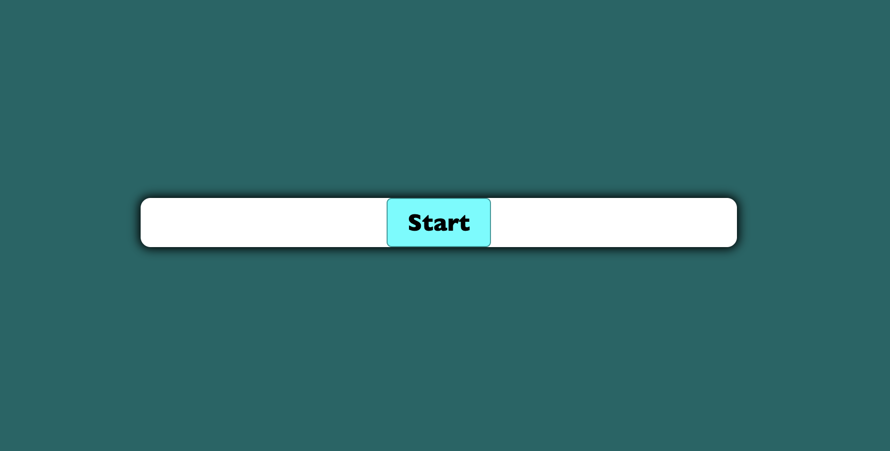

# Coding Quiz Challenge

## Purpose

This coding quiz challenge will help you develop some skills with learning the basics of coding!

## User Story

```
AS A coding boot camp student
I WANT to take a timed quiz on JavaScript fundamentals that stores high scores
SO THAT I can gauge my progress compared to my peers
```

## Acceptance Criteria

```
GIVEN I am taking a code quiz
WHEN I click the start button
THEN a timer starts and I am presented with a question
WHEN I answer a question
THEN I am presented with another question
WHEN I answer a question incorrectly
THEN time is subtracted from the clock
WHEN all questions are answered or the timer reaches 0
THEN the game is over
WHEN the game is over
THEN I can save my initials and score
```

## Built With:

- HTML
- CSS
- JavaScript

## Website

https://theresa2013.github.io/code-quiz-challenge/

## GitHub

https://github.com/Theresa2013/code-quiz-challenge.git

## Screenshots



## Contribution

Made by Theresa Butterfield
